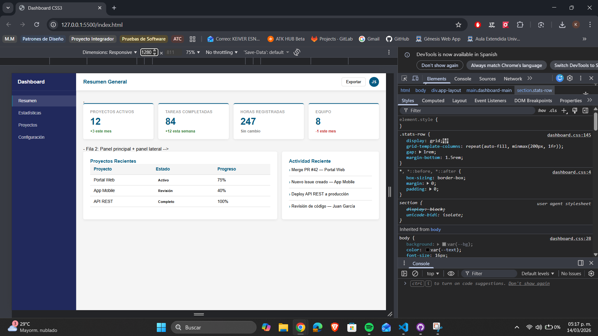
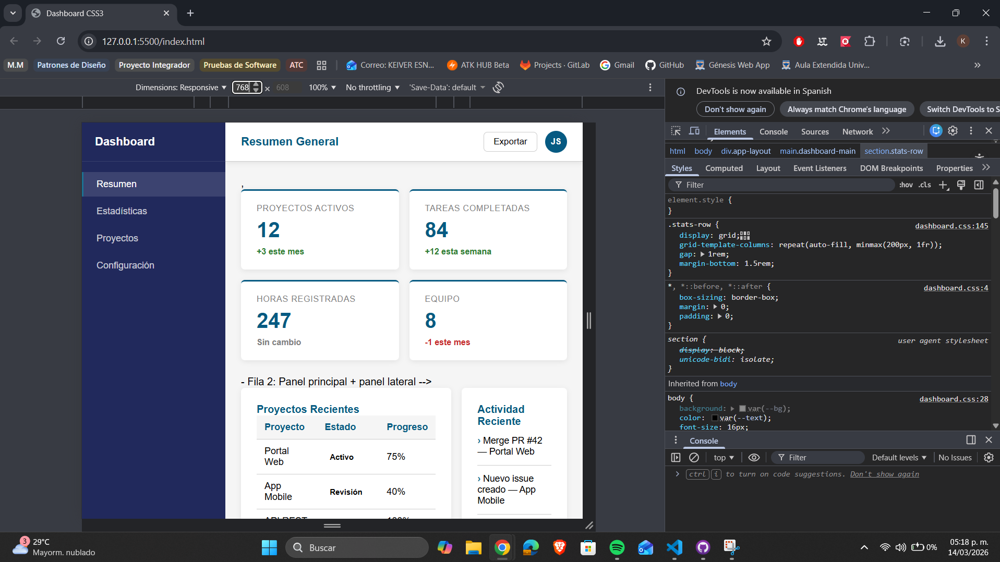

# castellanos-post2-u3

## Nombre del estudiante

Keiver Esneid Castellanos Julio

## Descripción del proyecto

El estudiante diseña e implementa el layout de un dashboard web responsivo combinando CSS Grid para la estructura de página y Flexbox para los componentes internos, sin el uso de frameworks CSS externos, demostrando el dominio de los modelos de layout modernos de CSS3 mediante una implementación funcional publicada en GitHub.

## Instrucciones de ejecución

1. Clona este repositorio o descarga los archivos.
2. Abre el archivo `index.html` en tu navegador web preferido.
3. Visualiza el dashboard y prueba la responsividad cambiando el tamaño de la ventana.

## Capturas de pantalla

A continuación, se deben agregar capturas de pantalla del dashboard funcionando a las siguientes resoluciones:

- **1280px de ancho**
- **768px de ancho**

Guarda las imágenes en una carpeta llamada `screenshots` y agrégalas aquí usando la siguiente sintaxis:

```


```
